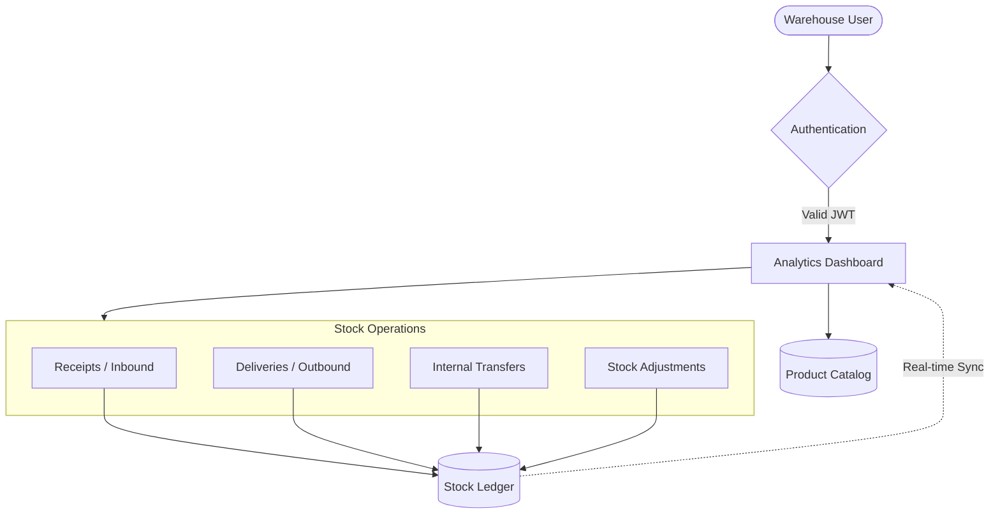

# Core Inventory Management System (IMS)

A modular, real-time, full-stack Inventory Management System designed to digitize and streamline warehouse operations. This system replaces manual registers with a centralized, secure digital interface, acting as the ultimate "source of truth" for warehouse inventory levels and stock movements.

---

## 🚀 Tech Stack & Architecture

- **Frontend (`web-client`)**: React.js, Tailwind CSS, Framer Motion (for premium micro-animations), and Axios (for API communication).
- **Backend (`core_api`)**: Python, Django, and Django REST Framework (DRF) serving a robust JSON API.
- **Database**: SQLite (Configured via `dj_database_url`, ready for PostgreSQL/MongoDB in production).
- **Authentication**: Secure JWT (JSON Web Tokens) with a 15-minute lifespan and Refresh tokens.
- **Email/Communications**: Brevo SMTP API integrated for robust "Forgot Password" functionality.

---

## 🎨 Key Features

1. **Dashboard & Analytics**: Real-time overview of warehouse health, Total Products, Low Stock Alerts, and movement KPIs.
2. **Product Catalog**: Centralized catalog tracking SKUs, Categories, Unit of Measure, Current Stock, and Reorder Levels.
3. **Stock Ledger (Movements)**: Tracks 4 primary operations:
   - *Receipts (Inbound)*: Vendor to Warehouse.
   - *Deliveries (Outbound)*: Warehouse to Customer.
   - *Transfers*: Internal movements between locations.
   - *Adjustments*: Manual corrections for loss/damage.
4. **Role-Based Access Control (RBAC)**: Supports roles like Admin, Manager, and Warehouse Staff, ensuring proper permissions.
5. **Robust Security**: Protected against brute-force attacks via DRF Throttling, fortified with strict Content Security Policies (CSP), HTTP Strict Transport Security (HSTS), and secure cookies.

---

## 🔄 System Workflow



---

## 🏗️ Architecture & Deployment

CoreInventory is designed as a **Single-Tenant Application**. 

This means the application is intended to be hosted by a *single company or organization* at a time. The database does not isolate data between different corporate entities by default. 

**If deploying for multiple companies:**
You must host a separate instance of the backend, frontend, and database for *each* company. This guarantees absolute data privacy and prevents cross-company data leakage without requiring complex Multi-Tenant schema routing.

---

## 📂 Project Structure

```text
CoreInventory/
│
├── core_api/                 # Django Backend Application
│   ├── core_api/             # Core project settings (settings.py, urls.py)
│   ├── identity/             # Auth app (Login, Register, Profiles, Password Reset)
│   ├── stock_ledger/         # Inventory app (Products, Movements, Locations)
│   ├── manage.py             # Django entry point
│   └── .env                  # Backend environment variables
│
├── web-client/               # React Frontend Application
│   ├── public/               # Static assets & index.html (with CSP configurations)
│   ├── src/                  # React source code (Components, Pages, API interceptors)
│   ├── package.json          # Frontend dependencies and scripts
│   └── tailwind.config.js    # Tailwind styling configurations
│
└── requirements.txt          # Python dependencies for the backend
```

---

## 🛠️ Getting Started (Local Development)

### 1. Backend Setup

Open a terminal and navigate to the backend directory:
```bash
cd core_api
```

Create and activate a virtual environment (recommended):
```bash
python -m venv .venv
# On Windows:
.venv\Scripts\activate
# On Mac/Linux:
source .venv/bin/activate
```

Install the dependencies:
```bash
pip install -r ../requirements.txt
```

Ensure your `.env` file is present in the `core_api/` directory (you will need `SECRET_KEY`, `DEBUG`, etc.). Then run migrations and start the server:
```bash
python manage.py migrate
python manage.py runserver 8000
```
*The backend API will now be running on `http://localhost:8000/`.*

### 2. Frontend Setup

Open a new terminal window and navigate to the frontend directory:
```bash
cd web-client
```

Install the Node.js dependencies:
```bash
npm install
```

Start the React development server:
```bash
npm start
```
*The frontend application will open automatically in your browser at `http://localhost:3000/`.*

---

## 👥 Team & Task Distribution

### **SHLOK**
- **Frontend Development**: Implementation of premium components and animated interfaces.
- **Connectivity**: Managing API integrations, state management, and data flow between client and server.

### **BHAVYA**
- **DB & Backend**: Designing database schemas and implementing core Python/Django logic.
- **API Architecture**: Building robust backend endpoints for inventory operations.

### **JYOTI**
- **Frontend Help**: Assisting with UI component building, styling, and ensuring design consistency.
- **UX Refinement**: Helping polish micro-animations and responsive layouts.

### **ARYAN**
- **Backend Specialist**: Working alongside BHAVYA on server-side logic and operational workflows.
- **Quality Assurance**: Testing backend endpoints and ensuring operational reliability.
